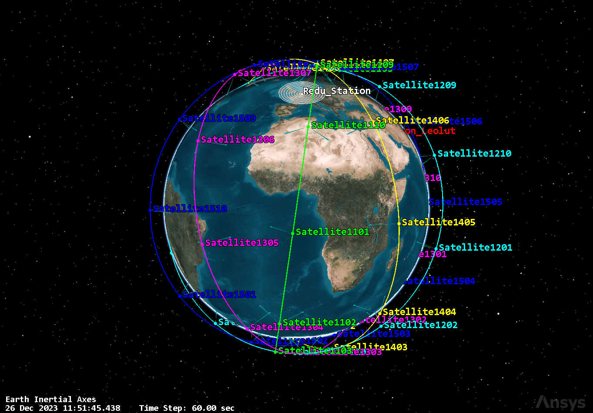
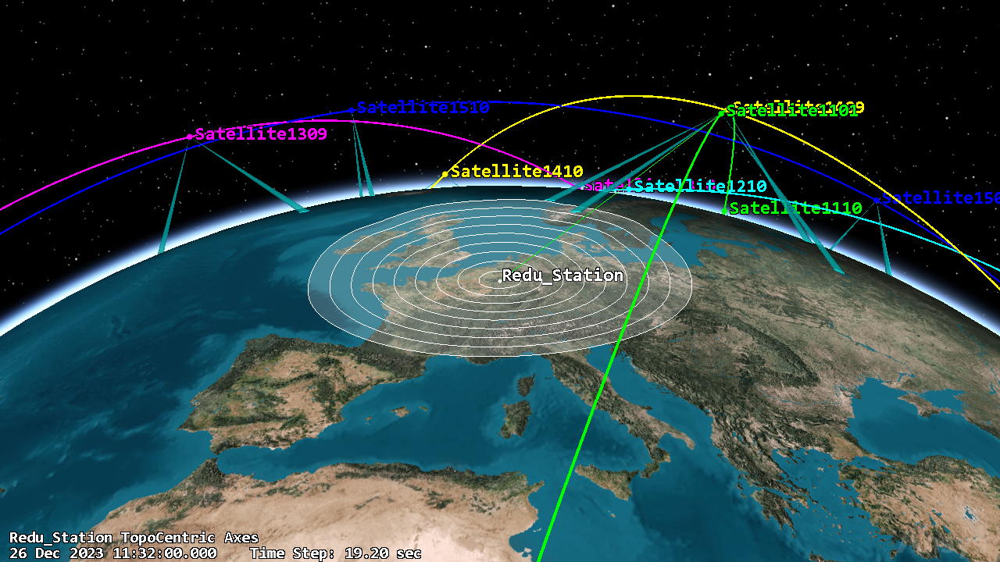

# LaSARCo

- **Space Mission Design Project (WS 2023 TUM)**
- **Objective**: Design a large Synthetic Aperture Radar (SAR) satellite Constellation for earth observation with global coverage. The proposed design aims to revolutionize Earth observation through the deployment of a cost-effective large satellite constellation designed to fulfill the objective of high-resolution imaging with enhanced revisiting frequency.

  
   

Image: Design of Satelllite Constellation, Satellite overpass of ground station 

# What's in this repository

- **Mission Analysis & Design**: The orbit and constellation design is modelled in STK as well as the ground stations. In the folder `orbit_constellation_design` it contains the STK model files.

- **TT&C**: TT&C is an integral part of efficient data transmission for downlink and uplink between satellite and ground stations. In the folder `TTC_link_budget` it contains the script for link budget analysis.